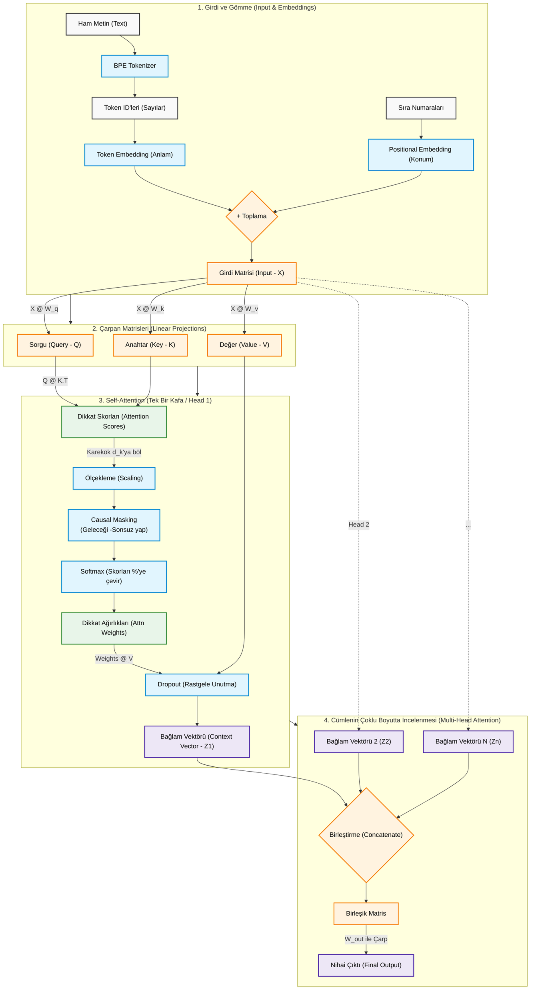

# Bölüm 3: Attention Mekanizmasını Kodlamak (Özet)

## Ana Fikir

Bu bölüm, LLM'lerin temel taşı olan ve bir metindeki kelimelerin birbirleriyle olan bağlamsal ilişkilerini ve önemini anlamalarını sağlayan "Attention" (Dikkat) mekanizmasını sıfırdan kodlamayı öğretir. Amaç, her bir kelime için, cümlenin geri kalanından gelen bilgileri akıllıca tartan bir "bağlam vektörü" (context vector) oluşturmaktır.

### Temel Kavramlar ve Süreç

1. **Self-Attention (Öz-Dikkat) Fikri:**

   * **Neden?** Bir kelimenin anlamı, yanındaki kelimelere göre değişir. Attention, bir kelimenin, cümlenin diğer tüm kelimeleriyle ne kadar "ilgili" olduğunu ölçer.
   * **Nasıl?** Her bir giriş token'ı (kelime embedding'i), üç farklı rolde kullanılır:
     * **Query (Sorgu - Q):** "Benimle ilgili bilgi arıyorum."
     * **Key (Anahtar - K):** "Ben bu bilgiyi sağlıyorum."
     * **Value (Değer - V):** "Eğer benimle ilgileniyorsan, sana sunacağım anlamsal içerik budur."
   * Süreç, **Sorgu** ve **Anahtar** vektörlerinin nokta çarpımı (`@`) ile bir "ilgi skoru" (attention score) hesaplanmasıyla başlar.
2. **Scaled Dot-Product Attention (Ölçeklenmiş Nokta Çarpımlı Dikkat):**

   * **Adım 1: Skorları Hesapla:** `attn_scores = queries @ keys.T`
   * **Adım 2: Skorları Ölçekle:** Hesaplanan skorlar, embedding boyutunun (`d_k`) kareköküne bölünerek stabilize edilir. Bu, gradyanların kaybolmasını veya patlamasını önler (`attn_scores / d_k**0.5`).
   * **Adım 3: Ağırlıkları Normalize Et:** `softmax` fonksiyonu uygulanarak skorlar, toplamları 1 olan olasılık benzeri "dikkat ağırlıklarına" (attention weights) dönüştürülür. Bu ağırlıklar, hangi kelimelerin daha önemli olduğunu gösterir.
   * **Adım 4: Bağlam Vektörünü Oluştur:** Bu ağırlıklar, **Value** vektörleriyle çarpılarak ağırlıklı bir toplam oluşturulur. `context_vec = attn_weights @ values`. Bu sonuç, kelimenin yeni, bağlamla zenginleştirilmiş temsilidir.
   * **💡 Kritik Optimizasyon Notları:**
     * **Neden Karekök'e Bölüyoruz? (Scaling):** Embedding boyutları ($d_k$) büyüdüğünde (örn: 768), çarpım skorları çok yüksek sayılara ulaşır. Puanlar çok büyürse Softmax fonksiyonu sapıtır (bir kelimeye %100, diğerlerine %0 verir) ve öğrenme durur (Vanishing Gradient). Skoru kareköke bölmek her zaman dengeli dağılımlar sağlar.
     * **Neden `nn.Linear` Kullanıyoruz?** $W_q, W_k, W_v$ matrislerini elle (`nn.Parameter`) yaratmak yerine PyTorch'un `nn.Linear(bias=False)` katmanını kullanmak tercih edilir. Çünkü Linear katmanlar, başlangıç ağırlıklarını (Weight Initialization) optimum şekilde rastgele dağıtarak modelin çok daha hızlı ve istikrarlı öğrenmesini sağlar.
3. **Causal Attention (Nedensel Dikkat):**

   * **Neden?** Bir metin oluştururken, modelin bir sonraki kelimeyi tahmin etmek için "gelecekteki" kelimeleri görmemesi gerekir; aksi halde kopya çekmiş olur.
   * **Nasıl?** Bir maske matrisi kullanılır. Softmax uygulanmadan önce, dikkat skor matrisinin üst üçgeni (geleceğe karşılık gelen pozisyonlar) `-torch.inf` (eksi sonsuz) ile doldurulur. Softmax bu değerleri sıfır yapar ve modelin geleceğe "bakmasını" engeller.
4. **Multi-Head Attention (Çok Başlı Dikkat):**

   * **Neden?** Bir cümlenin farklı anlamsal "katmanları" olabilir (gramer yapısı, anlam ilişkileri vb.). Tek bir attention mekanizması her şeyi yakalayamayabilir.
   * **Nasıl?** Self-Attention mekanizması paralel olarak birden çok kez (`num_heads` kadar) çalıştırılır. Her "baş" (head), girdinin farklı bir alt uzayını (representation subspace) öğrenir. Sonuçta, tüm başların çıktıları birleştirilir ve tek bir vektör haline getirilir. Bu, modelin aynı anda birden çok farklı ilişki türüne odaklanmasını sağlar.

### Teknik Uygulama (`ch03.ipynb`)

* **Temel Self-Attention:** `SelfAttention_v1` ve `SelfAttention_v2` sınıfları, `nn.Parameter` ve `nn.Linear` katmanları kullanarak aynı mekanizmanın nasıl kodlanabileceğini gösterir. `nn.Linear` daha standart ve önerilen bir yaklaşımdır.
* **Nedensel Dikkat:** `CausalAttention` sınıfı, `torch.triu` ile bir üst üçgen maskesi oluşturur ve `attn_scores.masked_fill_` kullanarak gelecekteki pozisyonları maskeler. Ayrıca, aşırı öğrenmeyi önlemek için `nn.Dropout` katmanı da içerir.

### 💡 İleri Seviye PyTorch Mekanikleri ve Sırlar

Son analizlerimizde ortaya çıkan kritik mühendislik harikaları:

* **Masking Neden Softmax'tan ÖNCE ve `-inf` ile Yapılır?**
  Gelecek kelimeleri (kopya çekmeyi) engellemek için, skor tablosunun `0` ile çarpılması Softmax yüzdelerini bozar (satır toplamı 1 etmez). Bunun yerine ham skorların üst üçgeni (gelecek) `-torch.inf` ile doldurulur (`masked_fill_`). Softmax bu eksi sonsuzları kusursuzca `%0`'a çevirirken, kalan geçerli skorları kendi aralarında `%100`'e dengeler.
* **Dropout'un Kusursuz Konumu:**
  `nn.Dropout`, Softmax işleminden hemen **SONRA** uygulanır. Böylece model, örneğin her defasında `%40` oranında güvendiği bir kelimeye takılıp kalmaz (ezber / overfitting yapmaz). Dropout o güçlü bağı aniden `%0`'a çeker, modeli diğer kelimelere de dikkat etmeye ve "mantık kurmaya" zorlar.
* **Çok-Başlı (Multi-Head) GPU Matris Hilesi (`transpose`):**
  Aynı süreç, 12 kafa için `for` döngüsüyle tek tek hesaplanmaz. Onun yerine 768 boyut, (12 Kafa x 64 Boyut) olarak sanal dilimlere (`view`) ayrılır. Ardından PyTorch'un GPU kuralı gereği sadece sondaki 2 boyut çarpıldığından, kafalar `.transpose(1, 2)` ile öne alınıp korunur, kelimeler ve boyutlar en sona atılarak tek salisede paralel eşzamanlı çarpım (`@`) yaptırılır.
* **Final Blender Katmanı (`out_proj`):**
  12 kafa kendi `64` boyutlu çıktılarını üretip uç uca eklediğinde boyut tekrar `768`'e çıkar. Ancak bu sadece zımbalanmış, yan yana duran bir veridir (örneğin sol taraf gramer, sağ taraf duygu). Sondaki `nn.Linear(768, 768)` katmanı, bu çapraz verilerin hepsini devasa bir ızgarada birbiriyle harmanlayarak (Linear Combination), çıktıdaki yeni 768 özelliğin her birine, diğer 12 kafadan çapraz lezzet katıp sentezlenmiş yepyeni bağlamlar oluşturur.

### Nihai Çıktı

Bölüm sonunda, bir girdi token dizisi (`[batch_size, num_tokens, d_in]`) alıp, her token için cümlenin bağlamına göre zenginleştirilmiş yeni bir temsil (`[batch_size, num_tokens, d_out]`) üreten, Transformer bloğunun temelini oluşturan tam bir `MultiHeadAttention` modülü elde edilir.

---

### Attention Mekanizması Akış Şeması

Aşağıdaki 	şema, ham metnin adım adım işlenerek `Multi-Head Attention` bloğundan nasıl geçtiğini gösteren genel bir röntgendir:

