# Bölüm 4: Büyük Dil Modeli (LLM) Mimarisinin İnşası (GPT-2)

> **Not**: Bu bölümdeki görseller (imageler) harici sunucudan yüklenmektedir. Eğer görünmüyorsa, tarayıcınızın internet bağlantısını kontrol edin veya kitaptaki orijinal görsellere bakın.

Bu bölümde, önceki bölümlerdeki bileşenleri (Tokenizasyon, Embedding, Multi-Head Attention) bir araya getirerek 124 Milyon parametreli gerçek bir GPT-2 modelini adım adım inşa ettik.

---

## 🔑 Önemli Noktalar ve Analizler

### ❓ Neden LayerNorm Kullanıyoruz?

- **Problem**: Derin ağlarda sayılar çarpılıp toplandıkça **vanishing/exploding gradient** olur
- **Çözüm**: Her katmandan önce aktivasyonları **ortalama=0, varyans=1** normalize et

### ❓ Neden Shortcut/Residual Kullanıyoruz?

- **Problem**: Gradient 12. katmandan 1. katmana dönerken **kayboluyor**
- **Çözüm**: `x = x + layer_output` ile **kısayol** oluştur

### ❓ Neden GELU/SiLU vs ReLU?

- **Problem**: ReLU negatif değerleri **tamamen sıfır yapıyor** ("dying ReLU")
- **Çözüm**: GELU/SiLU negatif bölgede de **küçük değerler geçirir**

### ❓ Katman Sayısı (`n_layers`) vs Kafa Sayısı (`n_heads`) Farkı Nedir?

- **Katman (Depth)**: Zekanın "Derinliği" ve **Muhakeme (Reasoning)** gücüdür. Daha derin mantık bağları kurmayı sağlar.
- **Kafa (Breadth)**: Dikkatin "Genişliği" ve **Bakış Açısı** çeşitliliğidir. Metni aynı anda kaç farklı uzmanlıkla (gramer, duygu, tarih vb.) taradığını belirler.
- **Denge**: Genelde önce kapasite (Heads/Emb) artırılır, sonra onu işleyecek derinlik (Layers) eklenir.

### ❓ Modelin RAM/Hafıza Boyutu Nasıl Hesaplanır?

- **Formül**: Parametre Sayısı × Veri Tipi Boyutu (Byte)
- **Float32 (Standart)**: 1 parametre = 4 Byte. (163M × 4 ≈ 621 MB)
- **Önemli**: Eğitim sırasında gradyanlar ve optimizer state'leri ile bu rakamın 3-4 katına ihtiyaç duyulur.

---

## 1. Mimarinın Yol Haritası

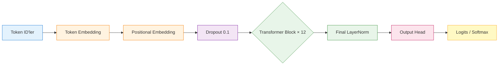

---

## 2. Bölüm 4.1: GPT-2 124M Konfigürasyonu

| Parametre      | Değer | Açıklama                        |
| -------------- | ------ | --------------------------------- |
| vocab_size     | 50257  | GPT-2 tokenizer sözcük sayısı |
| context_length | 1024   | Maksimum token uzunluğu          |
| emb_dim        | 768    | Embedding boyutu                  |
| n_heads        | 12     | Attention head sayısı           |
| n_layers       | 12     | Transformer block sayısı        |
| drop_rate      | 0.1    | Dropout oranı                    |
| qkv_bias       | False  | QKV bias kullanılmasın          |

### Model Yapısı

```
Token IDs → Token Embed → Pos Embed → Blocks × 12 → LayerNorm → Linear → Logits
```

---

## 3. Bölüm 4.2: Layer Normalization

### LayerNorm Formülü

```
output = scale × (x - mean) / √(var + eps) + shift
```

- **scale** ve **shift**: Öğrenilebilir parametreler (nn.Parameter)
- **eps**: Sıfıra bölünmeyi önlemek için 1e-5

### nn.Linear vs nn.Parameter

```python
# nn.Linear: Weight ve bias OTOMATİK oluşur
linear = nn.Linear(768, 768)  # y = Wx + b otomatik

# nn.Parameter: Manuel oluşturuyoruz
self.scale = nn.Parameter(torch.ones(768))  # Manuel
self.shift = nn.Parameter(torch.zeros(768)) # Manuel
# forward'da kendimiz hesaplıyoruz
```

### Pozisyonları

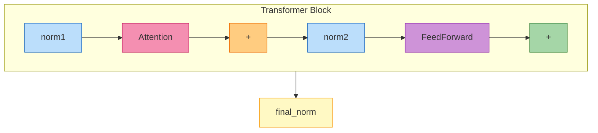

**Toplam**: 12 × 2 + 1 = **25 LayerNorm**

---

## 4. Bölüm 4.3: Feed Forward ve Aktivasyon Fonksiyonları

### Feed Forward Yapısı

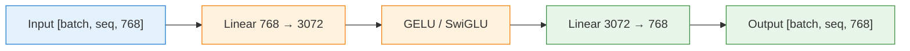

| Boyut          | Formül                      |
| -------------- | ---------------------------- |
| Input          | `[batch, seq, 768]`        |
| After Linear 1 | `[batch, seq, 3072]` (4×) |
| After GELU     | `[batch, seq, 3072]`       |
| After Linear 2 | `[batch, seq, 768]` (4÷)  |

### Aktivasyon Fonksiyonları Karşılaştırması

| Fonksiyon        | Formül        | Negatif Değerler        | Kullanım      |
| ---------------- | -------------- | ------------------------ | -------------- |
| **ReLU**   | max(0, x)      | 0 yapar (öler)          | CNN            |
| **GELU**   | 0.5x(1+tanh)   | Küçük değer geçirir | GPT-2, BERT    |
| **SiLU**   | x·σ(x)       | Daha geniş aralık      | MobileNet      |
| **SwiGLU** | SiLU(Wx)⊗(Vx) | 3 layer, gating          | LLaMA, Mixtral |

### SiLU vs SwiGLU

```python
# SiLU: Sadece aktivasyon fonksiyonu
y = nn.functional.silu(x)  # = x * sigmoid(x)

# SwiGLU: 3 layer'lı FFN modülü
class SwiGLU(nn.Module):
    def forward(self, x):
        return self.w3(nn.functional.silu(self.w1(x)) * self.v(x))
```

---

## 5. Bölüm 4.4: Shortcut Connections

### Problem: Vanishing Gradient

```
Layer 4 gradient: 0.0050  ← Güçlü
Layer 3 gradient: 0.0014  ← Zayıflıyor
Layer 2 gradient: 0.0007  ← Daha zayıf
Layer 1 gradient: 0.0001  ← Neredeyse sıfır!
Layer 0 gradient: 0.0002  ← ÖĞRENEMİYOR!
```

### Çözüm: Shortcut Connection

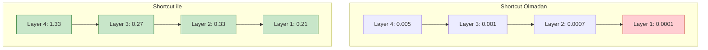

```python
shortcut = x
x = norm1(x)
x = attention(x)
x = x + shortcut  # ← GRADIENT DİREKT AKIYOR!
```

### Sonuç (Shortcut ile)

```
Layer 4 gradient: 1.3259  ← Güçlü
Layer 3 gradient: 0.2666  ← Hâlâ güçlü!
Layer 2 gradient: 0.3290  ← Güçlü!
Layer 1 gradient: 0.2069  ← Güçlü!
Layer 0 gradient: 0.2217  ← HÂLÂ ÖĞRENEBİLİYOR!
```

---

## 6. Bölüm 4.5: Transformer Block

### Pre-LayerNorm Mimarisi

```python
class TransformerBlock(nn.Module):
    def forward(self, x):
        # === ATTENTION BLOCK ===
        shortcut = x
        x = self.norm1(x)      # Pre-Norm
        x = self.att(x)       # Multi-Head Attention
        x = self.drop_shortcut(x)
        x = x + shortcut       # Residual

        # === FEED FORWARD BLOCK ===
        shortcut = x
        x = self.norm2(x)      # Pre-Norm
        x = self.ff(x)         # Feed Forward (GELU)
        x = self.drop_shortcut(x)
        x = x + shortcut       # Residual
      
        return x
```

### Transformer Block Diyagramı

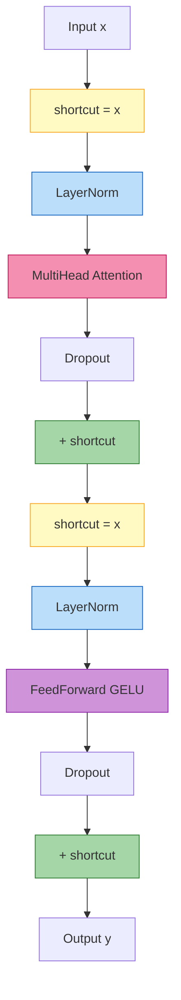

### LayerNorm Pozisyonları

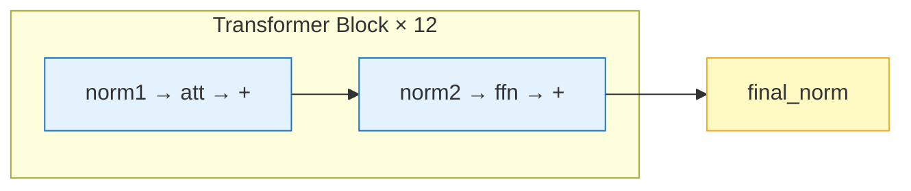

**Toplam LayerNorm**: 12 × 2 + 1 = **25**

### Parametreler (1 Block için)

| Bileşen               | Parametre     | Formül     |
| ---------------------- | ------------- | ----------- |
| W_query                | 589,824       | 768 × 768  |
| W_key                  | 589,824       | 768 × 768  |
| W_value                | 589,824       | 768 × 768  |
| out_proj               | 589,824       | 768 × 768  |
| Linear 1 (FFN)         | 2,359,296     | 768 × 3072 |
| Linear 2 (FFN)         | 2,359,296     | 3072 × 768 |
| LayerNorm              | 1,536         | 2 × 768    |
| **Toplam/Block** | **~7M** |             |

---

## 7. Bölüm 4.6: GPT Model ve Parametreler

### GPTModel Kodu

```python
class GPTModel(nn.Module):
    def __init__(self, cfg):
        self.tok_emb = nn.Embedding(50257, 768)      # 38.6M
        self.pos_emb = nn.Embedding(1024, 768)        # 0.8M
        self.drop_emb = nn.Dropout(0.1)                # 0
        self.trf_blocks = nn.Sequential(*[TransformerBlock] * 12)  # 85M
        self.final_norm = LayerNorm(768)                # 1.5K
        self.out_head = nn.Linear(768, 50257)         # 38.6M

    def forward(self, in_idx):
        x = self.tok_emb(in_idx) + self.pos_emb(...)
        x = self.drop_emb(x)
        x = self.trf_blocks(x)
        x = self.final_norm(x)
        return self.out_head(x)
```

### Tam Parametre Tablosu

| Katman                  | Parametre             | Hesaplama       |
| ----------------------- | --------------------- | --------------- |
| Token Embedding         | 38,597,376            | 50257 × 768    |
| Positional Embedding    | 786,432               | 1024 × 768     |
| Transformer Block × 12 | 84,953,088            | 7,079,424 × 12 |
| Final LayerNorm         | 1,536                 | 2 × 768        |
| Output Head             | 38,597,376            | 768 × 50257    |
| **TOPLAM**        | **163,009,536** |                 |

### Weight Tying Nedir?

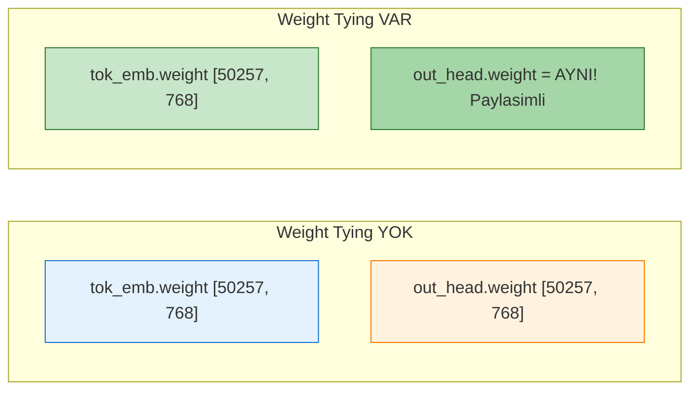

| Durum              | Toplam Parametre     |
| ------------------ | -------------------- |
| Weight Tying Yok   | 163,009,536          |
| Weight Tying Var   | 124,412,160          |
| **Tasarruf** | **38,597,376** |

---

## 8. Bölüm 4.7: Metin Üretimi (Greedy Decoding)

### Output Shape Açıklaması

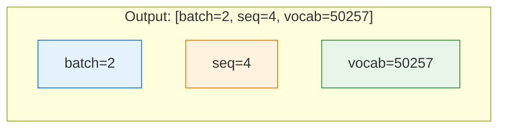

### Her Token Pozisyonu İçin

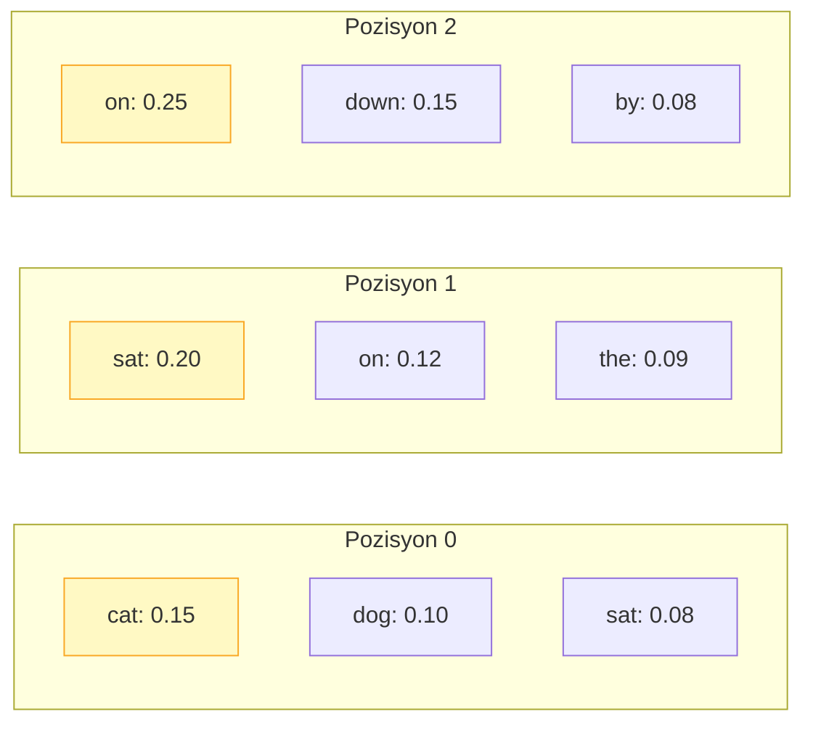

Aynısı pozisyon 1, 2, 3 için de geçerli!

### Greedy Decoding Algoritması

```python
def generate_text_simple(model, idx, max_new_tokens, context_size):
    for _ in range(max_new_tokens):
        idx_cond = idx[:, -context_size:]        # Context sınırla
        logits = model(idx_cond)                   # Tahmin al
        logits = logits[:, -1, :]                 # Son token'e odaklan
        probas = torch.softmax(logits, dim=-1)    # Olasılığa çevir
        idx_next = torch.argmax(probas, dim=-1)  # En yüksek olasılıklı
        idx = torch.cat((idx, idx_next), dim=1)   # Sequence'e ekle
    return idx
```

### generate_text_simple Adım Adım

| Adım | Kod                                   | Açıklama                            |
| ----- | ------------------------------------- | ------------------------------------- |
| 1     | `idx_cond = idx[:, -context_size:]` | Sadece son 1024 token'i al            |
| 2     | `logits = model(idx_cond)`          | Modelden tahmin al                    |
| 3     | `logits[:, -1, :]`                  | Sadece son token'in çıktısını al |
| 4     | `softmax(logits)`                   | Logits'i olasılığa çevir          |
| 5     | `argmax(probas)`                    | En yüksek olasılıklı token'i seç |
| 6     | `torch.cat((idx, idx_next))`        | Yeni token'i sequence'e ekle          |

### Input Hazırlama

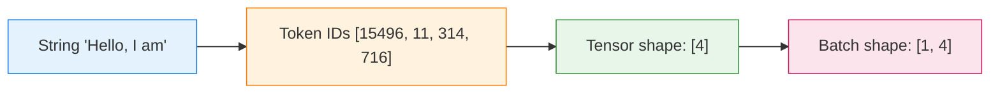

### Üretim Döngüsü (Generation Loop)

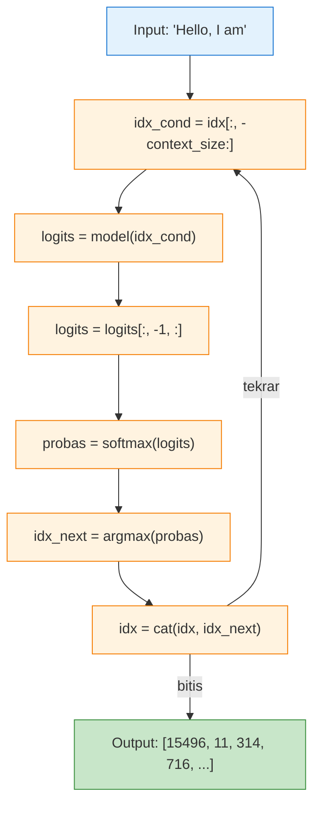

```python
start_context = "Hello, I am"

# 1. Tokenize et (string → token ID'ler)
encoded = tokenizer.encode(start_context)
# [15496, 11, 314, 716]

# 2. List → Tensor
encoded_tensor = torch.tensor(encoded)
# tensor([15496, 11, 314, 716])  shape: [4]

# 3. Batch dimension ekle
encoded_tensor = encoded_tensor.unsqueeze(0)
# tensor([[15496, 11, 314, 716]])  shape: [1, 4]
```

### Adım Adım Örnek

| Iteration                                        | idx                              | idx_next  | Açıklama        |
| ------------------------------------------------ | -------------------------------- | --------- | ----------------- |
| 0                                                | `[15496, 11, 314, 716]`        | -         | Başlangıç      |
| 1                                                | `[15496, 11, 314, 716, 27018]` | `27018` | "am" → "fine"    |
| 2                                                | `[..., 27018, 24086]`          | `24086` | "fine" → "today" |
| ...                                              | ...                              | ...       | ...               |
| n                                                | `[..., X1, X2, Xn]`            | `Xn`    | Sonraki token     |
| (max_new_tokens kez tekrarla)                    |                                  |           |                   |
| ↓                                               |                                  |           |                   |
| Output: [15496, 11, 314, 716, 27018, 24086, ...] |                                  |           |                   |

```

### torch.no_grad() Neden Kullanılır?
- **Inference**: Sadece forward pass yapıyoruz, eğitim yok
- Gradient hesaplamaya gerek yok
- Memory ve hız tasarrufu sağlar

### 📓 C. gpt_model_details.ipynb

**İçerik:**
- GPTModel sınıfı tam kodu
- Forward pass adım adım açıklaması
- Parametre hesaplama detayları
- Weight tying açıklaması ve görselleştirme
- Memory hesaplama (FP32, FP16, int8)
- Tüm GPT-2 versiyonları karşılaştırması
- ASCII mimari diyagramı

**Referans:** ch04.ipynb Bölüm 4.6

---

## 9. Eklediğimiz Notebook'lar ve Analizler

### 📓 A. activation_functions.ipynb

**İçerik:**
- Sigmoid vs Softmax (farkları ve kullanım alanları)
- ReLU vs GELU vs SiLU vs SwiGLU
- Görselleştirmeler ve grafikler
- Karar rehberi

**Referans:** ch04.ipynb Bölüm 4.3

### 📓 B. gradient_and_backward_pass.ipynb

**İçerik:**
- `model.named_parameters()` ile tüm parametreleri görme
- `state_dict()` kullanımı
- Forward Pass detaylı açıklaması
- Backward Pass ve zincir kuralı
- **Pozitif/Negatif gradient açıklaması**
- **Türev (derivative) kavramı**
- Vanishing gradient problemi

**Referans:** ch04.ipynb Bölüm 4.4

---

## 10. Özet: GPT-2'nin Tam Akışı

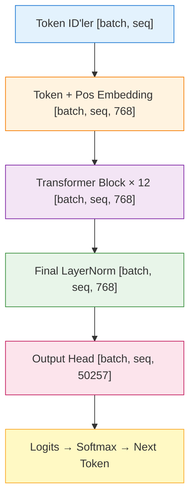

### Akış Tablosu

| Adım | Katman                | Input Shape             | Output Shape            |
| ----- | --------------------- | ----------------------- | ----------------------- |
| 1     | Token IDs             | `[batch, seq]`        | -                       |
| 2     | Token + Pos Embedding | `[batch, seq]`        | `[batch, seq, 768]`   |
| 3     | Transformer × 12     | `[batch, seq, 768]`   | `[batch, seq, 768]`   |
| 4     | Final LayerNorm       | `[batch, seq, 768]`   | `[batch, seq, 768]`   |
| 5     | Output Head           | `[batch, seq, 768]`   | `[batch, seq, 50257]` |
| 6     | Softmax/Argmax        | `[batch, seq, 50257]` | Token ID                |

---

## 📚 Önemli Kavramlar Sözlüğü

| Terim                        | Açıklama                                          |
| ---------------------------- | --------------------------------------------------- |
| **LayerNorm**          | Aktivasyonları normalize et (mean=0, var=1)        |
| **Pre-LayerNorm**      | Layer'ın önüne konan norm (daha stable)          |
| **GELU**               | Transformer'da kullanılan yumuşak aktivasyon      |
| **SiLU**               | x × sigmoid(x) - SwiGLU'nun temeli                 |
| **SwiGLU**             | Modern LLM'lerde (LLaMA, Mixtral)                   |
| **Shortcut/Residual**  | Gradient akışını iyileştiren kısayol          |
| **Weight Tying**       | Embedding ve Output'un aynı weight'ı paylaşması |
| **Backward Pass**      | Gradient'ların zincir kuralı ile hesaplanması    |
| **Vanishing Gradient** | Gradient'ın deep network'te kaybolması            |
| **Greedy Decoding**    | En yüksek olasılıklı token'i seçme             |
| **out_proj**           | Attention head'ları birleştiren linear layer      |

---

## 🔧 Önemli Sorular ve Cevaplar

| Soru                         | Cevap                                      |
| ---------------------------- | ------------------------------------------ |
| Dropout neden parametresiz?  | Öğrenmez, rastgele nöron kapatır       |
| model.train() vs eval()?     | train=dropout açık, eval=dropout kapalı |
| nn.Linear vs nn.Parameter?   | Linear: Wx+b otomatik, Parameter: manuel   |
| LayerNorm neden 2 parametre? | scale (γ) ve shift (β) öğrenilebilir   |
| out_proj neden var?          | Head'ları birleştirmek için             |
| Weight tying ne işe yarar?  | 38.6M parametre tasarrufu sağlar          |

### ❓ out_proj Ne İşe Yarar?

- Multi-head'lerin farklı bakış açılarını tek bir vektörde birleştirmek için
- 12 head × 64 dim → tek 768 vektöre dönüştürür
- Her head farklı "uzmanlık" alanına sahiptir (dilbilgisi, duygu, v.b.)
- out_proj bu uzmanlıkları birleştirir

### ❓ Model Neden Saçmalıyor?

- **Durum**: Model "Hello, I am Featureiman..." gibi saçma metin üretiyor
- **Neden**: Mimari (vücut) hazır ama ağırlıklar (bilgi) hala rastgele. Henüz eğitilmedi (Pretraining yapılmadı)

### ❓ Greedy (Açgözlü) Üretim Nedir?

- **Mantık**: Her adımda sadece en yüksek olasılıklı (Argmax) kelimeyi seçer
- **Döngü**: Bir kelime üretir, cümleye ekler, sonra uzayan cümleyi TEKRAR okuyup bir sonrakini üretir
- **Dezavantaj**: Her zaman en iyisini seçmez, tekrarlayan metin oluşabilir

### ❓ Temperature, Top-K, Nucleus Sampling Nedir?

- **Temperature**: Olasılıkları "yumuşatır" veya "sertleştirir"
  - Düşük (0.1): Daha kesin, daha az çeşitli
  - Yüksek (1.0+): Daha çeşitli, daha yaratıcı
- **Top-K**: Sadece en olası K token'i seçer
- **Nucleus (Top-P)**: Olasılıkları birikimli olarak sırala, %p'ye kadar al

### ❓ torch.no_grad() Ne İşe Yarar?

- **Eğitimde**: Gradient hesaplanır (backward pass için gerekli)
- **Inference'da**: Gradient gerekmez
- `torch.no_grad()`: Gradient hesaplamayı kapatır → Memory ve hız tasarrufu

### ❓ model.eval() Ne İşe Yarar?

- Dropout'u kapatır
- BatchNorm/LayerNorm'ları inference moduna alır
- Aynı input her zaman aynı output verir (deterministik)

### ❓ .unsqueeze(0) Nedir?

- Batch dimension ekler
- `[4]` → `[1, 4]` (tek batch, 4 token)

---

## Sonraki Adımlar

1. **Chapter 5**: Modeli eğitme
2. **Chapter 6**: Pretrained weight yükleme
3. **Generation**: Temperature, top-k, nucleus sampling

---

> **Notebook Konumları:**
>
> - `ch04/01_main-chapter_code/activation_functions.ipynb`
> - `ch04/01_main-chapter_code/gradient_and_backward_pass.ipynb`
> - `ch04/01_main-chapter_code/gpt_model_details.ipynb`
> - `ch04/01_main-chapter_code/parameter_memory_optimization.ipynb`
> - `ch04/01_main-chapter_code/BOLUM4_OZETI.md`
