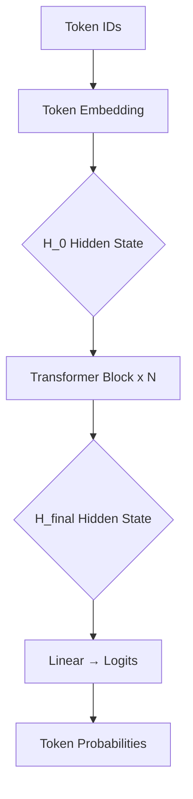

# GPT'den LLaMA'ya: Mimari Dönüşüm Rehberi

Bu belge, orijinal GPT (GPT-2/GPT-3) mimarisinden Meta AI'ın LLaMA (Llama 2, Llama 3, Llama 3.2) mimarisine dönüşümü kapsamlı bir şekilde ele almaktadır. Sebastian Raschka'nın "Build a Large Language Model From Scratch" kitabının Chapter 5 ve 7 bölümlerindeki kod referansları temel alınmıştır.

---

## 1. GPT ve LLaMA Mimari Farkları

### 1.1 Temel Yapısal Farklılıklar

| Özellik | GPT (Orijinal) | LLaMA (Llama 2/3) | Avantaj |
|---------|----------------|---------------------|---------|
| **Normalizasyon** | LayerNorm | RMSNorm | %10-20 daha hızlı hesaplama |
| **Aktivasyon** | GELU | SwiGLU | Daha güçlü non-linearity |
| **Pozisyonlama** | Mutlak (Absolute) | RoPE (Rotary) | Uzun bağlam desteği |
| **Dikkat Mekanizması** | MHA | GQA | VRAM tasarrufu |
| **Bias** | bias=True | bias=False | Daha az parametre |

### 1.2 Hidden State'in Yolculuğu



### 1.3 Her İki Mimaride de Hidden State

Hidden State, modelin "içsel hafızası"dır:
- **Boyutu**: `[Batch, Seq_Length, Embed_Dim]`
- **Logits aşamasında** dönüşür: Hidden State ölür, kelime olasılıkları doğar

---

## 2. LLaMA'nın Getirdiği 4 Büyük Yenilik

### 2.1 RMSNorm (Root Mean Square Normalization)

**LayerNorm (GPT):**
```python
# Kaynak: ch04/04_gqa/gpt_with_kv_gqa.py:129-141
class LayerNorm(nn.Module):
    def forward(self, x):
        mean = x.mean(dim=-1, keepdim=True)
        var = x.var(dim=-1, keepdim=True, unbiased=False)
        norm_x = (x - mean) / torch.sqrt(var + self.eps)
        return self.scale * norm_x + self.shift
```

**RMSNorm (LLaMA):**
- Ortalama hesaplamaz
- Sadece RMS (Root Mean Square) alır
- **Sonuç**: Daha hızlı, %10-20 performans artışı

### 2.2 SwiGLU (Swish Gated Linear Unit)

**GELU (GPT):**
```python
# Kaynak: ch04/03_kv-cache/gpt_with_kv_cache_optimized.py:146-155
class GELU(nn.Module):
    def forward(self, x):
        return 0.5 * x * (1 + torch.tanh(
            torch.sqrt(torch.tensor(2.0 / torch.pi)) *
            (x + 0.044715 * torch.pow(x, 3))
        ))
```

**SwiGLU (LLaMA):**
- Veriyi iki koldan geçirir
- Bir kol Swish aktivasyonundan geçer
- Diğer kol direk geçer
- Element-wise multiplication ile birleştirilir
- **Sonuç**: Daha güçlü öğrenme kapasitesi

### 2.3 RoPE (Rotary Positional Embeddings)

**Mutlak Pozisyonlama (GPT):**
- Her token'a pozisyon bilgisi embedding aşamasında eklenir
- Uzun metinlerde extrapolation sorunu

**RoPE (LLaMA):**
- Token'lar modele **pozisyon bilgisi almadan** girer
- Pozisyon bilgisi Attention'ın **içinde** verilir
- Query ve Key vektörleri döndürülür (rotary)
- **Sonuç**: 100K+ token bağlam desteği

### 2.4 GQA (Grouped-Query Attention)

**MHA (GPT):**
- Her head için ayrı Key-Value saklanır
- VRAM yoğun

**GQA (LLaMA):**
- Örn: 8 Query head = 1 Key-Value head paylaşımı
- **Sonuç**: 8 kata varan VRAM tasarrufu

---

## 3. GPT'den LLaMA'ya Dönüşüm Adımları

Bu bölüm, `ch05/07_gpt_to_llama/` klasöründeki kod referanslarına dayanmaktadır.

### 3.1 Dönüşüm Sırası

```
GPT (Orijinal) → Llama 2 → Llama 3 → Llama 3.1/3.2
```

**Referans Dosyalar:**
- `converting-gpt-to-llama2.ipynb`: GPT → Llama 2 dönüşümü
- `converting-llama2-to-llama3.ipynb`: Llama 2 → Llama 3 dönüşümü
- `standalone-llama32.ipynb`: Llama 3.2 bağımsız implementasyonu

### 3.2 Llama 3.2 Konfigürasyonları

**Llama 3.2 1B:**
```python
# Kaynak: pkg/llms_from_scratch/llama3.py
LLAMA32_CONFIG_1B = {
    "vocab_size": 128_256,
    "context_length": 131_072,
    "emb_dim": 2048,
    "n_heads": 32,
    "n_layers": 16,
    "hidden_dim": 8192,
    "n_kv_groups": 8,
    "rope_base": 500_000.0,
    "dtype": torch.bfloat16,
}
```

**Llama 3.2 3B:**
```python
LLAMA32_CONFIG_3B = {
    "vocab_size": 128_256,
    "context_length": 131_072,
    "emb_dim": 3072,
    "n_heads": 24,
    "n_layers": 28,
    "hidden_dim": 8192,
    "n_kv_groups": 8,
    "rope_base": 500_000.0,
    "dtype": torch.bfloat16,
}
```

---

## 4. Model Yükleme ve Kullanım

### 4.1 Kurulum

```bash
pip install llms_from_scratch blobfile
```

### 4.2 Ağırlık İndirme

```python
import requests

MODEL_FILE = "llama3.2-1B-instruct.pth"
url = f"https://huggingface.co/rasbt/llama-3.2-from-scratch/resolve/main/{MODEL_FILE}"

response = requests.get(url, stream=True, timeout=60)
response.raise_for_status()
with open(MODEL_FILE, "wb") as f:
    for chunk in response.iter_content(chunk_size=8192):
        if chunk:
            f.write(chunk)
```

### 4.3 Model Yükleme

```python
import torch
from llms_from_scratch.llama3 import Llama3Model, LLAMA32_CONFIG_1B

model = Llama3Model(LLAMA32_CONFIG_1B)
model.load_state_dict(torch.load(MODEL_FILE, weights_only=True, map_location="cpu"))

device = torch.device("cuda" if torch.cuda.is_available() else "cpu")
model.to(device)
```

### 4.4 Tokenizer Kurulumu

```python
from llms_from_scratch.llama3 import Llama3Tokenizer, ChatFormat

TOKENIZER_FILE = "tokenizer.model"
tokenizer = Llama3Tokenizer(TOKENIZER_FILE)

# Instruct modelleri için
tokenizer = ChatFormat(tokenizer)
```

### 4.5 Metin Üretimi

```python
from llms_from_scratch.ch05 import generate, text_to_token_ids, token_ids_to_text

PROMPT = "What do llamas eat?"
MAX_NEW_TOKENS = 150
TEMPERATURE = 0.0
TOP_K = 1

torch.manual_seed(123)

token_ids = generate(
    model=model,
    idx=text_to_token_ids(PROMPT, tokenizer).to(device),
    max_new_tokens=MAX_NEW_TOKENS,
    context_size=LLAMA32_CONFIG_1B["context_length"],
    top_k=TOP_K,
    temperature=TEMPERATURE
)

output_text = token_ids_to_text(token_ids, tokenizer)
print(output_text)
```

---

## 5. Performans Optimizasyonları

### 5.1 FlashAttention ile Hızlandırma

```python
# Llama3Model yerine Llama3ModelFast kullan
from llms_from_scratch.llama3 import Llama3ModelFast

model = Llama3ModelFast(LLAMA32_CONFIG_1B)
```

| Model | Tokens/sec | VRAM |
|-------|------------|------|
| Llama3Model | 42 | 2.91 GB |
| Llama3ModelFast | 54 | 2.91 GB |

### 5.2 Torch Compile ile Hızlandırma

```python
model = torch.compile(model)
model.to(device)
```

| Model | Tokens/sec | VRAM |
|-------|------------|------|
| Llama3Model | 170 | 3.12 GB |
| Llama3ModelFast | 177 | 3.61 GB |

### 5.3 KV Cache ile Hızlandırma

```python
from llms_from_scratch.kv_cache.llama3 import Llama3Model
from llms_from_scratch.kv_cache.generate import generate_text_simple

model = Llama3Model(LLAMA32_CONFIG_1B)
# ...
```

**CPU Performans (Mac Mini M2):**

| Mod | Tokens/sec |
|-----|------------|
| Regular | 1 |
| KV Cache | 68 |
| KV Cache + Compile | 86 |

---

## 6. Kaynak Kod Dosyaları

### 6.1 Referans Dosyalar

| Dosya | Konum | Açıklama |
|-------|-------|----------|
| LayerNorm | `ch04/04_gqa/gpt_with_kv_gqa.py:129-141` | GPT LayerNorm implementasyonu |
| GELU | `ch04/03_kv-cache/gpt_with_kv_cache_optimized.py:146-155` | GPT GELU implementasyonu |
| Llama3Model | `pkg/llms_from_scratch/llama3.py` | Llama 3.2 tam implementasyonu |
| GPT to Llama2 | `ch05/07_gpt_to_llama/converting-gpt-to-llama2.ipynb` | Dönüşüm notebook'u |
| Llama2 to Llama3 | `ch05/07_gpt_to_llama/converting-llama2-to-llama3.ipynb` | Llama 2→3 notebook'u |

### 6.2 Mimari Dosya Yapısı

```
LLMs-from-scratch/
├── ch04/
│   ├── 03_kv-cache/
│   │   └── gpt_with_kv_cache_optimized.py
│   └── 04_gqa/
│       └── gpt_with_kv_gqa.py
├── ch05/
│   └── 07_gpt_to_llama/
│       ├── converting-gpt-to-llama2.ipynb
│       ├── converting-llama2-to-llama3.ipynb
│       └── standalone-llama32.ipynb
└── pkg/
    └── llms_from_scratch/
        ├── llama3.py
        ├── ch04.py
        └── ch05.py
```

---

## 7. Özet

Orijinal GPT mimarisi, modern LLaMA mimarisine dönüştürülürken şu kritik değişiklikler yapılır:

1. **LayerNorm → RMSNorm**: Daha hızlı normalizasyon
2. **GELU → SwiGLU**: Daha güçlü aktivasyon
3. **Mutlak Pozisyon → RoPE**: Uzun bağlam desteği
4. **MHA → GQA**: VRAM tasarrufu
5. **bias=True → bias=False**: Daha az parametre

Bu dönüşüm, `ch05/07_gpt_to_llama/` klasöründeki notebook'lar aracılığıyla adım adım gerçekleştirilebilir. Modern tüm açık kaynak modeller (Mistral, Qwen, DeepSeek vb.) bugün LLaMA-benzeri bu iyileştirmeleri kullanmaktadır.
