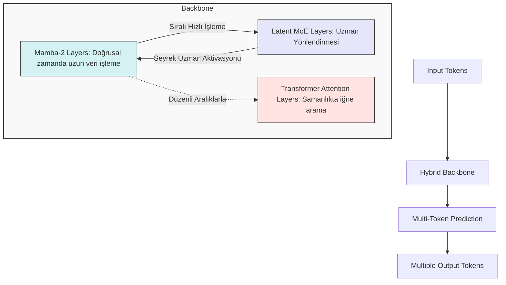

# NVIDIA Nemotron 3 Super: Mimari, Veri Setleri ve Uygulama Rehberi

NVIDIA'nın karmaşık "Yapay Zeka Ajanı" (Agentic AI) iş akışlarını çözmek üzere tasarladığı, **1M (Bir Milyon) token bağlam (context)** açıklığına ve 120 Milyar parametreye sahip güçlü açık ağırlıklı (open-weights) modeli **Nemotron 3 Super** hakkında detaylı mimari, eğitim ve altyapı bilgilerini içerir.

## 1. Mimari Tasarım (Hibrit Mamba-Transformer MoE)

Nemotron 3 Super, 3 farklı popüler ağ mimarisinin yenilikçi birleşimidir. Aşağıdaki şema modelin iç çalışma mekanizmasını basitçe gösterir:

*(NVIDIA Developer bloglarından Nemotron 3 Mimarisine ait bir görsel:)*

### Öne Çıkan Mimari Yenilikler

1. **Latent MoE (Sıkıştırılmış Uzmanlar Karışımı):** Klasik MoE'lerde tokenler büyük halleriyle uzmanlara iletilirken, Nemotron 3 Super tokenleri önce "sıkıştırıp (Latent Space)" sonra uzmanlara gönderir. Bu sayede aynı bilgisayar gücüyle 1 yerine **4 farklı uzmana** başvurabilir. Model toplam **120B** parametredir ancak **çıkarım anında sadece 12B** aktif parametre çalıştırarak %90 donanım tasarrufu sağlar.
   
2. **Native NVFP4 Ön-Eğitimi:** Sonradan yapılan sıkıştırmada (quantization) kalite kayıpları olmakla beraber, bu model Blackwell B200 donanımında en başından itibaren saf **4-bit** matematikle eğitilmiş ve FP8 Hopper'lara göre **4x daha hızlıdır.**

3. **MTP (Multi-Token Prediction):** Her seferinde 1 kelime öngörmek yerine aynı anda çoklu gelecek tokenı tahmin ederek oluşturmadan önce mantıksal plan yapar ve taslak süresini (speculative decoding) **3 kat hızlandırır.**

---

## 2. Açık Kaynak Algoritmalar: Cookbooks & Recipes

Modeli kullanmak, yerel ağınızda çalıştırmak veya ince ayar (fine-tuning) yapmak için NVIDIA'nın sağladığı resmi altyapılar:

*   **[Nemotron 3 Super GitHub Reposu](https://github.com/NVIDIA/Nemotron)**: Kurulum, OpenHands, OpenCode gibi ajan yapılarına direk adaptasyon ve değerlendirme (eval) yönergeleri.
*   **[TensorRT-LLM Cookbook](https://github.com/NVIDIA/TensorRT-LLM)**: Üretim/Sunucu ortamlarına yönelik en düşük gecikmeyle çalıştıran TensorRT derleyici şablonu.
*   **[vLLM / SGLang Cookbook](https://docs.vllm.ai/)**: Sürekli akış ve tool-calling için hızlı dağıtım şablonları.
*   **NeMo İnce Ayar Şablonları:** 
    *   *LoRA & SFT:* NeMo Automodel ve Megatron-Bridge ile sektöre özel ince ayar yönergeleri.
    *   *GRPO & DAPO:* Ajan düşünme modelini (reasoning) hizalamak için pekiştirmeli eğitim (RL) algoritmaları ([NVIDIA NeMo RL](https://github.com/NVIDIA/NeMo)).

---

## 3. Açık Veri Setleri (Datasets) ve Veri Tabancası

Bu devasa ağı eğitmek için kullanılan şeffaf veri kaynakları listesi;

*   **Pretraining (Ön Eğitim) 25 Trilyon Token:**
    *   10 Trilyon yüksek kaliteli, yinelenebilir temiz İngilizce token.
    *   **[Nemotron-Pretraining-Specialized-v1.1](https://huggingface.co/datasets/nvidia/Nemotron-Pretraining-Specialized-v1.1):** Yazılım, algoritma dili, mantık yapısı ve ekonomi test veri seti (Açık kaynak sunulmuştur).
    *   Ek olarak 15 milyon saf kod problem çözümü.
*   **Supervised Fine-Tuning (SFT):**
    *   **[Nemotron-Super-Post-Training-Data](https://huggingface.co/datasets/nvidia/Nemotron-Super-Post-Training-Data):** Çeşitli ajan analiz görevlerini ve yetki testlerini (RL ve SFT testlerini) barındıran dev veri seti. İçerisinde 40 Milyon örneklem bulunur (7 Milyonu aktif eğitimde kullanılmıştır).
*   **RLHF Çevreleri (~1.2 Milyon Rollout):** NVIDIA NeMo Gym kullanılarak modelin kendi başına kod testi yapması ve kod ayıklaması gibi 21 farklı senaryoda test edilen pekiştirmeli görev ağaçları. (En az 10 adedi Hugging Face'te yer alır.)

---

## 4. Kullanım Lisansı ve Test Performans Listesi

*   **Model Kullanım Lisansı:** *NVIDIA Open Model License* ile ücretsiz ve ticari kullanım sunulmuştur (Ancak telif hırsızlığına veya Guardrails -güvenlik sınırlarını kırmaya- çalışırsanız lisans iptal olur).
*   **[HuggingFace Üzerinde Ağırlık İndirme (Base, FP8, NVFP4, vb.)](https://huggingface.co/nvidia/Nemotron-3-Super-120B-A12B-Base)**

**Test Başarıları Kısa Özet:**
*   **Terminal Bench:** GPT-OSS-120B ve Qwen3.5'in çok ötesinde (Ajan kodlama yeteneğinde birinci sınıf kapasite).
*   **Context (RULER 1M):** %91.75 isabetle sınıf lideri.
*   **Hız:** Qwen3.5-122B'ye göre ~7.5x kat daha hızlı bir çıkarım (throughput).

---
*Daha fazla teknik PDF dokümanı ve detaylı Whitepaper analizleri için NVIDIA'nın resmi [Nemotron 3 Super Build NIM Sayfası](https://build.nvidia.com/)'nı ziyaret edebilirsiniz.*
